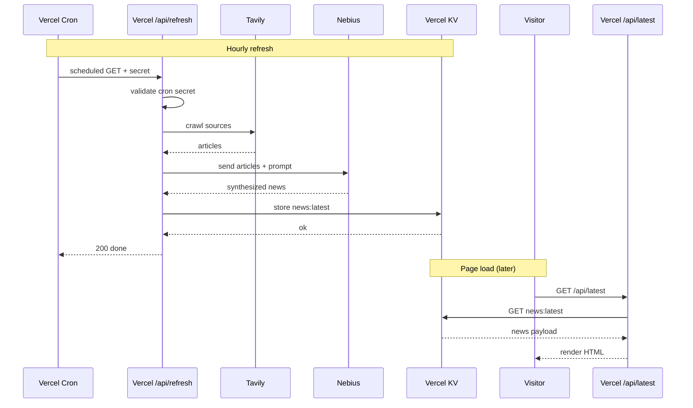

# RFC — The News of the Day

## Problem & goal

Following the daily news through dozens of outlets is noisy and time-consuming, yet most days have one story that actually matters. The News of the Day is a one-page website that surfaces a single, LLM-synthesized "news of the day" with links to the sources it was built from, refreshed every 3 hours.

The goal is a calm, glanceable replacement for doomscrolling a feed — open the page, get one well-sourced story, close the tab.

A secondary goal is hands-on practice with Vercel Cron, Tavily, Nebius, and Vercel KV.

## Non-goals

- No user accounts, sign-in, or personalization.
- No archive — only "today" is visible; older entries may exist in storage but aren't surfaced.
- No comments, reactions, or social features.
- No multi-story feed — exactly one news item per refresh.
- No mobile app — responsive web only.
- No live/breaking-news guarantees — hourly refresh, not real-time.
- No editorial control panel — the LLM's output is what ships (no human-in-the-loop step in v1).

## Success criteria

- The site is live on a public Vercel URL (custom domain optional).
- Vercel Cron has run `/api/refresh` every 3 hours for 7 consecutive days with no manual intervention.
- On any visit, the page renders a single headline + dek + image + at least 3 source links.
- The main news shows a "last updated" timestamp; if the timestamp is older than 210 minutes, a stale warning is shown.

## Proposed solution

### Sequence diagram

The hourly refresh runs server-side; the browser only reads from `/api/latest`.



### Tools

| Task | Tool |
|---|---|
| Write & edit code | Claude Code (desktop) |
| Preview UI while building | Browser at `localhost:3000` |
| Web framework | Next.js (TypeScript + Tailwind) |
| Hourly refresh trigger | Vercel Cron |
| Crawl news sources | Tavily API (called from `/api/refresh`) |
| Synthesize daily news | Nebius-hosted LLM (called from `/api/refresh`) |
| Refresh + secret validation | Route `/api/refresh` |
| Store latest news | Vercel KV (key `news:latest`) |
| Serve news to the page | Route `/api/latest` |
| Render the page | Frontend (reads `/api/latest`) |
| Host the live site | Vercel |
| Version control & auto-deploy | GitHub → Vercel |
| Secrets / API keys | `.env.local` + Vercel env vars (incl. `CRON_SECRET`) |

### Data contract

The value at KV key `news:latest` is a single JSON object written by `/api/refresh` and read by `/api/latest` (which returns it to the frontend as-is). Future per-day archive keys (e.g. `news:2026-05-20`) would use the same shape.

```ts
type NewsEntry = {
  date: NewsDate;
  news: NewsBody;
  sources: NewsSource[];
};

type NewsDate = {
  date: string;            // ISO date, e.g. "2026-05-21" (frontend formats it in the user's local TZ)
};

type NewsBody = {
  imageUrl?: string;       // one of the images parsed from the sources, optional
  headline: string;        // the main news title
  dek: string;             // one-sentence summary under the headline
  generatedAt: string;     // timestamp of the refresh run
};

type NewsSource = {
  title: string;           // article title as the source published it
  outlet: string;          // e.g. "New York Times", "BBC"
  url: string;
};
```

### News sources list

Tavily crawls the following outlets. The list is intentionally broad (geographically and politically) and biased toward sites without hard paywalls so the crawler can actually read article bodies.

1. BBC News — `bbc.com/news`
2. Reuters — `reuters.com`
3. Associated Press — `apnews.com`
4. The Guardian — `theguardian.com`
5. New York Times — `nytimes.com` _(soft paywall)_
6. Al Jazeera English — `aljazeera.com`
7. Bloomberg — `bloomberg.com/uk`
8. The Wall Street Journal — `wsj.com` _(hard paywall, may yield headlines only)_

### LLM prompt sketch

**System prompt (sketch).** You are a wire-service editor. Given the articles below, identify the single most important story of the day and write one headline (≤12 words) and one dek (≤30 words, one sentence). Use only facts present in the provided articles — do not infer, speculate, or add context not in the sources. If sources disagree on a fact, omit it. Paraphrase rather than quote — no verbatim passages over ~15 words from any single source. Pick a tone that is calm and neutral (Reuters/AP style), not opinionated. Choose between 3 and 6 sources for the `sources` array, preferring ones that independently confirm the story. If a usable image URL appears in the source articles, include it as `imageUrl`. Return a JSON object matching the `NewsEntry` schema — nothing else, no prose around it.

**User prompt (sketch).** Each Tavily article is passed as `{ outlet, title, url, publishedAt, body }` in a JSON array. Today's date (ISO, e.g. "2026-05-21") is provided alongside as a string.

**Failure modes.** If fewer than 3 articles are returned by Tavily, the refresh aborts and KV is not overwritten. If the LLM returns invalid JSON or fewer than 3 sources, the refresh aborts. The previous `news:latest` stays in place until the next successful run.

### Observability

- **Logs.** `/api/refresh` logs are visible in the Vercel dashboard (Project → Logs). Every run logs: start, Tavily query count + status, Nebius model + status, KV write status, total duration. Errors log with stack.
- **Stale warning on the page.** `/api/latest` includes `generatedAt`. If it's older than 210 minutes (3h cycle + 30 min slack), the frontend shows a subtle "last updated X minutes ago" warning under the dek, in red.

## Open questions

- **Nebius model choice.** Which specific Nebius-hosted model do we use? Trade-off between cost, latency, and JSON-mode quality. Decide after smoke-testing.
- **Tavily query budget.** Free tier has a monthly quota — at 8 refreshes/day × 8 sources = 64 queries/day, ~1900/month. Need to verify this fits before going live.
- **Cold-start state.** On first deploy, KV is empty until the first cron fires. What does `/` show in the first 0–3 hours? (Options: a placeholder "first refresh pending"; trigger refresh on first load; etc.)
- **Duplicate-story handling.** If two consecutive refreshes pick the same headline, do we still overwrite, or keep the older `generatedAt`? Probably overwrite, but worth deciding.

## Implementation plan

_Draft — not started yet._

1. **Repo & scaffold.** Create GitHub repo, run `create-next-app`, push `RFC.md` and `DESIGN.md`, ship a placeholder page.
2. **Provision accounts & env vars.** Vercel, Vercel KV, Tavily, Nebius. Wire `.env.local` and Vercel envs.
3. **Smoke-test each tool.** Four throwaway scripts (`scripts/*-ping.ts`) to confirm Tavily, Nebius, KV, and Vercel Cron each work in isolation.
4. **`/api/refresh` happy path.** Tavily → Nebius → KV, returning `NewsEntry`. Manual trigger only (cron not yet enabled).
5. **`/api/latest`.** Reads KV, returns `NewsEntry` as JSON.
6. **Frontend.** Renders the page from `/api/latest` to match the design (WSJ-style typography, date header, image, headline, dek, sources list, footer).
7. **Cron + secret.** Add `CRON_SECRET` validation to `/api/refresh`; enable Vercel Cron at `0 */3 * * *`.
8. **Edge states.** Stale warning (>210 min), cold-start placeholder, "fewer than 3 sources" abort path.
9. **Polish.** Favicon, page `<title>`, meta description, OG image. Custom domain deferred.
